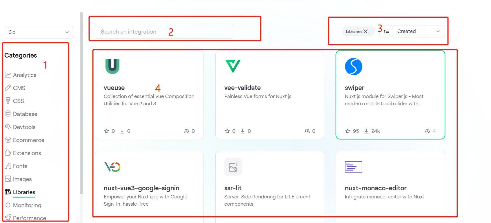
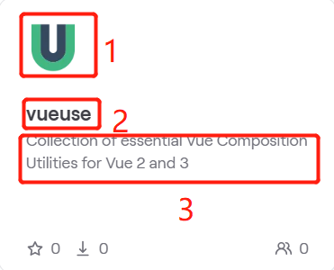
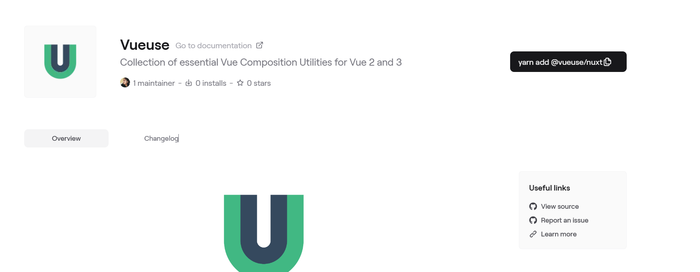

# [aipocket](https://github.com/wishtodaya/aipocket)

> AI资源导航站
>
> 包含内容：
>
> + chatgpt plugins （本次开发）
> + AI资源导航  （后续开发）
> + AI 新闻展示 （后续开发）

以下为本次开发内容，建议组件放在chatgpt 目录下

## 组件

### 1.Nav组件

+ 1.网站图标组件：LOGO
+ 2.导航列表组件，可拓展，目前只需要展示Plugins/News/Resoures
+ 3.外链导航组件

### 2.内容区组件

+ 1.分类组件：可拓展列表
+ 2.搜索组件：按名称搜索
+ 3.标签过滤：过滤条件，Popular/New/All
+ 4.展示卡片：点击进入详情介绍

| 图标 | 插件名称 | 插件描述 |
| ---- | -------- | -------- |
| 1    | 2        | 3        |

  

### 3.Footer组件

参考一般footer组件

### 4.卡片详情组件

内容待确认，参考网站设计

